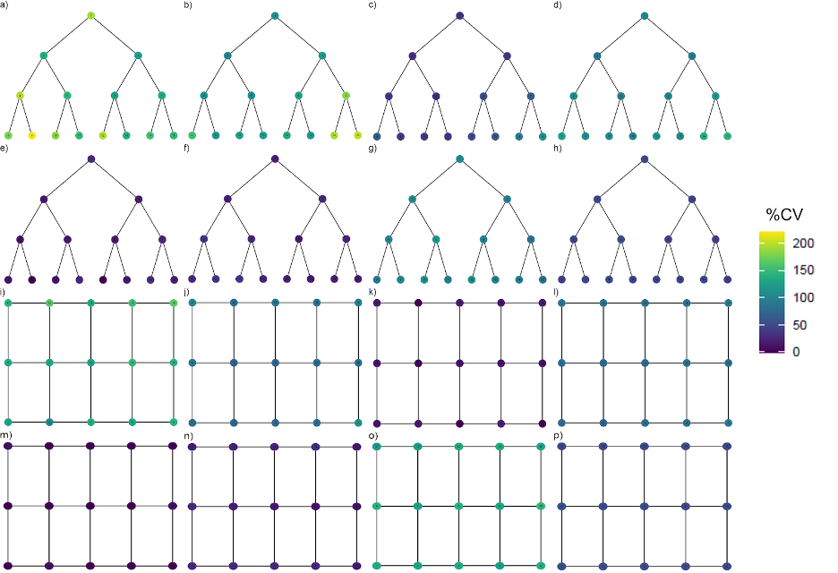

# Protist Network Project

Title: Long transients and network structure effect persistence and spatial predator-prey dynamics in experimental microcosms

Status of MS: Re-submitted to Jounral of Animal Ecology

Authors: Matthew D. Green, Clara A. Woodie, Megan Whitesell, and Kurt E. Anderson

# Structure of Code

1) Orgnaize.data.R  organizes and merges data files. Also makes Table S1
2) Plotting.R makes all figures used in the manuscript (Fig. 2,3,5,7)
3) Occupnacy analysis.R runs the glm analysis for Table S2, S3
4) ext_col_phases_analysis.R runs analysis for ext/col dynamics through the phases (Table S6)
5) pred_ccup_analysis.R runs anlaysis for Table S7
6) Trophic_analysis.R runs anlaysis for Table S8

# Methods

### Photo of Experimental Setup

### Fig 1: Figure of Experimental Setup

# Results

### Fig 2: Time Series of Predator-Prey Dynamics

### Fig 3: Predator-Prey Occupancy Dynamics

### Fig 4: Predator-Prey Extinction Dynamics

### Fig. 5: Predator Prey Predicted Occupancy Dynamics

### Fig. 6:Trophic Dynamics

# Supplemental

### Fig S1: Spatial Mean Occupancy Dynamics

#### Fig S2: Spatial CV Dynamics

